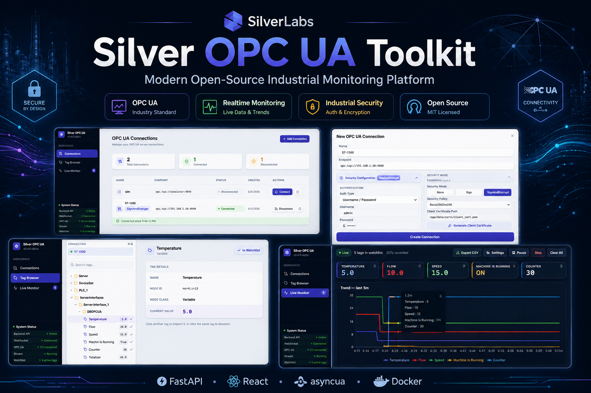
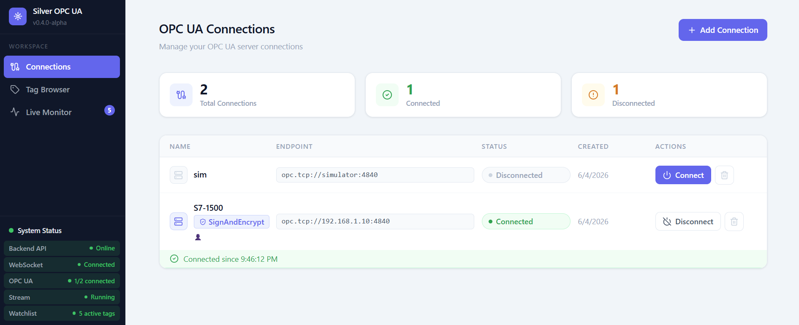
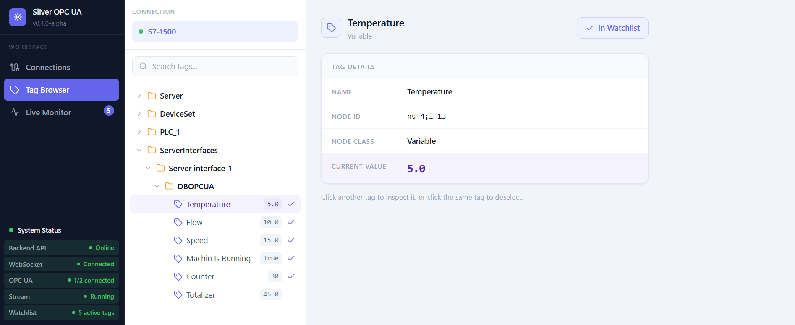
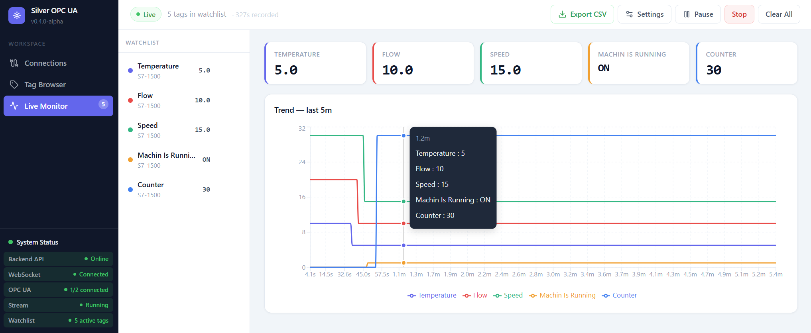
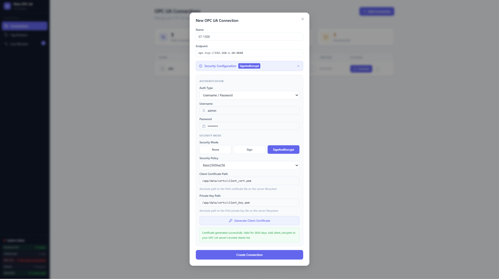

# Silver OPC UA Toolkit

Modern open-source OPC UA toolkit for industrial monitoring, realtime visualization, secure connectivity, and future industrial AI workflows.

Built for industrial engineers, automation developers, system integrators, and Industry 4.0 environments.

---

## Overview

Silver OPC UA Toolkit is a modern industrial software platform focused on creating lightweight, developer-friendly, and cross-platform industrial tools around OPC UA.

The project aims to modernize industrial monitoring workflows with clean UI, realtime data handling, secure OPC UA connectivity, scalable tag navigation, and future AI-assisted industrial tooling.

The toolkit is designed for:

- Industrial Engineers
- Automation Developers
- PLC Programmers
- System Integrators
- IIoT Developers
- Smart Factory Environments

---

## Why Silver OPC UA Toolkit?

Most industrial software tools are:

- Outdated
- Windows-only
- Difficult to use
- Built around legacy UX patterns
- Poor at realtime workflows
- Expensive and vendor-locked

Silver OPC UA Toolkit aims to provide a modern alternative with:

- Modern web-based UI
- Realtime industrial workflows
- Secure OPC UA communication
- Cross-platform architecture
- Lightweight deployment
- Open-source flexibility
- Future-ready AI integration

---

## Current Features

### Implemented

#### OPC UA Connectivity

- OPC UA Connection Manager
- Realtime OPC UA Monitoring
- Scalable Tag Browser
- Searchable OPC UA Navigation
- Watchlist-based Monitoring Workflow
- Persistent Watchlists
- Connection Health Monitoring

#### OPC UA Security

- Security Mode Support:
  - None
  - Sign
  - SignAndEncrypt

- Security Policy Support:
  - Basic256Sha256
  - Aes128Sha256RsaOaep
  - Aes256Sha256RsaPss

- Authentication:
  - Anonymous
  - Username / Password

- Client Certificate Generation
- Certificate-based OPC UA Security
- Human-readable Security Error Messages

#### Monitoring & Visualization

- WebSocket-based Realtime Updates
- Realtime Charts
- Configurable Update Rates
- Configurable Monitoring Windows
- CSV Export
- Alarm & Threshold Visualization
- Boolean Tag Support
- System Status Panel

#### Platform

- Structured Logging
- Dockerized Deployment
- Industrial Simulator Environment
- Modern Industrial SaaS-style UI

---

## Architecture Overview

```text
OPC UA Server
      ↓
asyncua Client Layer
      ↓
FastAPI Backend
      ↓
REST API + WebSockets
      ↓
React Frontend
```

---

## Compatibility

Silver OPC UA Toolkit is designed to work with standard OPC UA servers and industrial environments.

Validated with:

- Generic OPC UA servers
- asyncua-based servers
- Custom OPC UA endpoints
- Siemens-compatible String Node IDs (`ns=X;s=TagName`)

Compatibility testing will continue to expand during beta releases.

---

## Tech Stack

### Backend

- Python 3.12
- FastAPI
- asyncua
- SQLAlchemy (async)
- WebSockets
- Pydantic
- pydantic-settings
- uv

### Frontend

- React 19
- TypeScript
- Tailwind CSS
- shadcn/ui
- Recharts
- Vite

### Infrastructure

- Docker
- Docker Compose
- nginx

---

## Quick Start

### Requirements

- Python 3.12+
- Node.js 20+
- uv (`pip install uv`)
- Docker (optional)

---

## Clone Repository

```bash
git clone https://github.com/silverlabs-dev/Silver-OPCUA-Toolkit.git
cd Silver-OPCUA-Toolkit
```

---

## Development Setup

### Terminal 1 — OPC UA Simulator

```bash
cd backend
uv run python simulator/server.py
```

Simulator runs on `opc.tcp://localhost:4840` by default.

> **Windows note:** Port 4840 may be blocked by `opcualds.exe`.
> Use an alternate port:
> ```powershell
> $env:SIMULATOR_PORT="4841"; uv run python simulator/server.py
> ```
> In this case use `opc.tcp://localhost:4841` as the endpoint in the UI.

### Terminal 2 — Backend

```bash
cd backend
uv run python run.py
```

Backend API:

```text
http://localhost:8000/docs
```

### Terminal 3 — Frontend

```bash
cd frontend
npm install
npm run dev
```

Frontend:

```text
http://localhost:5173
```

---

## Docker Quick Start

Run the complete stack:

```bash
docker compose up --build
```

Services:

| Service | URL |
|----------|----------|
| Frontend | http://localhost:8080 |
| Backend API | http://localhost:8000/docs |
| OPC UA Simulator | opc.tcp://simulator:4840 |

> When using Docker, use `opc.tcp://simulator:4840` as the OPC UA endpoint.

---

# Screenshots

## Connections Management



Modern OPC UA connection management with realtime status tracking, retry monitoring, health visibility, and security-aware connection workflows.

---

## Tag Browser



Scalable industrial tag browser with recursive OPC UA navigation, search capabilities, and watchlist integration.

---

## Live Monitoring



Realtime monitoring dashboard with watchlists, alarms, threshold visualization, configurable update rates, CSV export, and live trend charts.

---

## Security Configuration



Secure OPC UA connection setup supporting authentication methods, security modes, security policies, and certificate-based communication.

---

## Roadmap

### v0.5.0-beta

1. Multi-Connection Monitoring
2. Endpoint Discovery
3. Production Deployment Documentation
4. Performance Validation

### Future Releases

- Historical Data Logging
- MQTT Integration
- Alarm & Event Workflows
- OPC UA Write Support
- Multi-device Monitoring
- Trust Store Management
- AI-assisted Diagnostics
- Predictive Maintenance
- Industrial AI Copilot

---

## Project Status

Current status: **v0.4.0-alpha**

The project is under active development and focused on building a modern industrial monitoring platform around OPC UA and future industrial AI workflows.

Current alpha focus areas:

- Realtime industrial monitoring
- OPC UA security
- Authentication and certificate workflows
- Modern industrial UX
- Scalable OPC UA navigation
- Lightweight deployment
- Open-source industrial tooling

---

## Contributing

Contributions, feedback, architecture discussions, bug reports, and industrial workflow ideas are welcome.

If you work with industrial automation, OPC UA, SCADA, IIoT, or Industry 4.0 technologies, your feedback is highly valuable.

---

## License

Licensed under the Apache License 2.0.